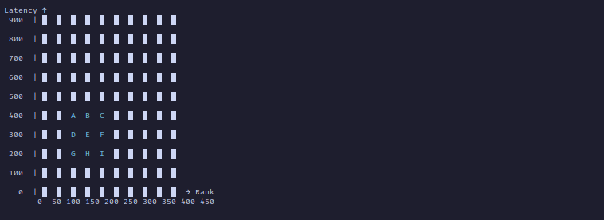

# Vinom

Vinom is a secure and scalable system designed for managing real-time communication and game matchmaking. It implements a secure protocol using DTLS and provides authentication, user management, and game server communication.

## System Architecture

Looking at the design, you might ask, "Is all this necessary?" But bear with me—I built this project as a learning experience, and overcomplicating personal projects is a great way to learn.

Let's break down the architecture and explain it.

### Problem Statement

I wanted to build a simple game server where communication speed matters. The system should include a rating system and match players based on their rating and network latency. Additionally, I aimed to strengthen my knowledge of distributed systems and microservices.

### From Problem Statement to a General User Story

1. A player signs up and then signs in.
2. They request a match and wait in a matchmaking room.
3. When another player with a similar rating and latency is found, a game room is created.
4. Players compete to score more points than their opponent while receiving real-time state updates.

### From User Story to a List of Services

1. **Identity Service**
2. **Matchmaking Service**
3. **Session Manager**
4. **Game Service**
5. **Rating Service**

---

## Matchmaking

Vinom Matchmaker is a Redis-based game matchmaking system I developed for the **Vinom project**. It features an interesting solution, and I believe this is the only development project where I applied my DSA knowledge.

### How Does It Work?

It creates separate queues (similar to **bucket sort**) where the queue key is structured as **scaled-rank:scaled-latency**. The reason for **scaling** is to allow a **tolerable rank and latency difference**.

Every time a player requests a match, we **check if there are enough matchable players** in the existing queues.

How do we check?
You can think of the **queues as a 2D grid**.

Take the table below as an example. Let's assume **A, B, C, D, E, F, G, H, and I** were already in their own queues.
- When a **new request (E)** comes in, we add it to its queue.
- Then, we collect all players in the neighboring queues that fall within the tolerable range.
- These players are then sorted based on waiting time, and a configured number of players are dequeued** to send a create match game room request.

By using queues based on latency and rank, we effectively avoid searching through all waiting players—instead, we only check 9 queues at max. Clever, right? 💥

Thanks to Redis distributed lock keys, we can also ensure that other queues are not affected during this process.

#### Example: Latency Tolerance of 100, Rank Tolerance of 50

---

## Game Session Manager and Game Server

We have two main components here: the **Session Manager** and the **Game Server**. The **Session Manager** is responsible for sending game server responses to clients and forwarding client requests to the respective game servers.

### How Does It Work?

When a game match is found, the matching server sends a new gamer request to the **Session Manager**. The **Session Manager** creates a new instance of the game and starts it, while also adding the players to a session list. The **Session Manager** has access to a UDP socket manager.

When a client tries to connect to the socket, the **Socket Manager** asks the **Session Manager** to authenticate the client. If there is a game session for that client, the **Session Manager** allows the connection, and the **Socket Manager** establishes a secure connection.

When the client sends a request, the **Socket Manager** passes it to the **Session Manager**. The **Session Manager** maps the client to the respective game server and forwards the message. The **Game Server** processes the request and provides the response to the **Session Manager**, which then sends the response to the appropriate clients.

### Unreliable Network Communication

There's one issue left without discussion: we are communicating over an unreliable network (UDP). Messages might be lost or retransmitted, and we need to handle this properly to avoid negative effects on the game. The key things communicated between the client and server are the game state and move action requests.

For the client side, the solution is relatively simple. We attach a version number to the game state. If we receive a game state with the same or lower version, we ignore it.

However, for the server logic, we can't just use a version number. Why? Imagine two clients sending a move action at the same time, both sending the same version number. One of them gets executed first, causing the game version to change. This means the second request might be rejected, but it doesn't have to be.

To solve this, I came up with the idea of giving each client their own version number. Instead of using an additional version variable, we can use the client's current position as the version. When a client sends an action request, they will include their current position on the grid as their own version number under their ownership. This ensures that no one else can change it, preventing the two simultaneous requests from blocking each other.

---

## Terminal Client

Terminal client for Vinom game.

---

## Development Process

First, I worked on utility logic that was new and challenging for me, such as:
- A Redis-based matchmaker
- A secure UDP socket
- A maze generator

After that, I developed the system as a monolith using clean architecture. Once the monolith was stable, I migrated to a microservices architecture. This transition was relatively easy because a well-structured clean architecture makes separation straightforward. You can see how I managed the migration by comparing the final monolith version with the current microservices version, both of which are tagged in the repository.

## Is It Complete?

No, and that's okay. One piece of advice I received from senior engineers is that for personal projects, you should stop when you feel you've learned what you set out to learn. My goal was to understand microservices, sockets, system design, RPC, Redis, Kubernetes, and RabbitMQ. I believe I've gained solid knowledge in these areas.

## What's Left to Do?

Service communication should be made more reliable, possibly by using **Temporal**.

We need to introduce **Kubernetes** to manage the spawning of game servers.

## Why Did I Build the Client Side in the Terminal?

1. I developed the socket manager using Golang, and switching to JavaScript would have been a major headache.
2. I've been enjoying terminal-based tools, and I thought this would be a good introduction.

## External Libraries

- **Secure UDP Socket Manager**: [GitHub](https://github.com/beka-birhanu/udp-socket-manager)
- **Maze Generator**: [GitHub](https://github.com/beka-birhanu/wilson-maze)

---

Note: Dancing is key.

