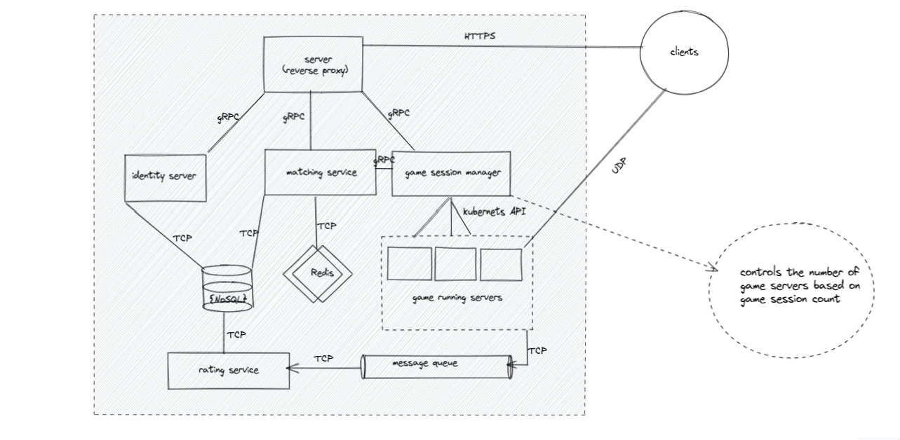
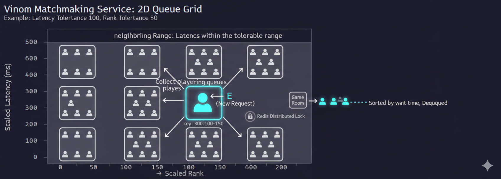
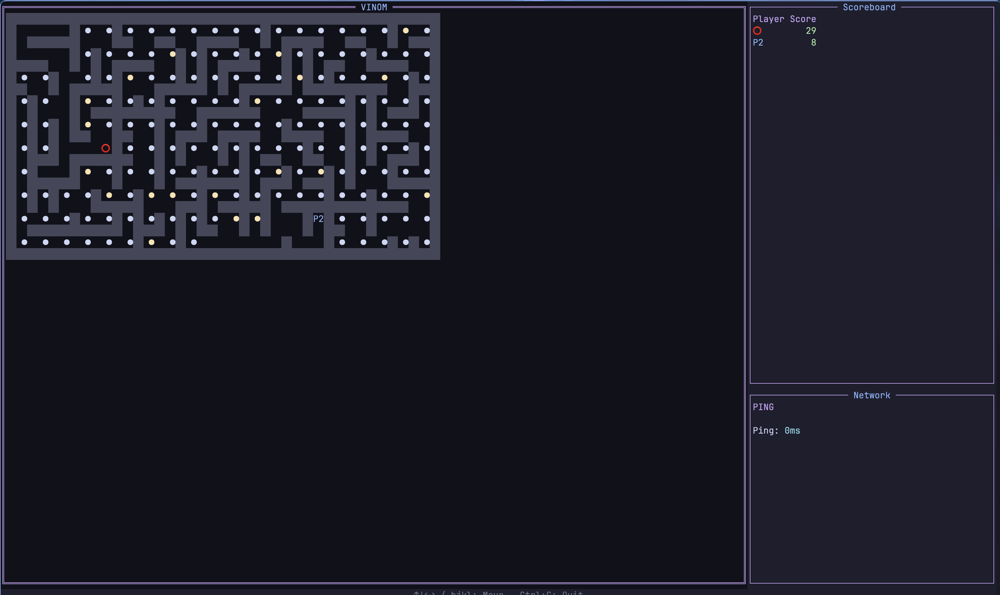

  
  <h1>Vinom</h1>
  
A multiplayer maze game where communication speed matters — with rating-based matchmaking, secure UDP gameplay, and a terminal client.

---

## What Is This?

Vinom is a personal project I built to explore game servers, real-time networking over UDP, Redis-based algorithms, and terminal UI. It's a real-time multiplayer maze game where players collect rewards, and the winner is whoever collects the most.

The project started as microservices (three separate repos) and has since been collapsed into a monorepo with a monolith architecture because the infrastructure overhead stopped being educational.

## System Architecture

The system has three main components:

| Component     | Description                                                                             |
| ------------- | --------------------------------------------------------------------------------------- |
| **`api/`**    | Game server — handles auth, matchmaking, game sessions, and real-time UDP communication |
| **`client/`** | Terminal client — TUI for login, matchmaking, and playing the maze game                 |
| **`common/`** | Shared protobuf definitions and interfaces used by both sides                           |

---

## API

The server is a Go service backed by:

### Matchmaking

The matchmaker uses a bucketed queue approach inspired by bucket sort. Instead of scanning all waiting players, each player is placed in a Redis sorted set keyed by their scaled rank and latency:

When a new player queues, the server checks the 9 neighboring buckets (a 3×3 grid around the player's bucket). If enough players are found within tolerance, the top `N` are dequeued by wait time and matched into a game room. Redis distributed locks prevent race conditions across concurrent match requests.

### Session Manager & Game Service

When a match is found, the Session Manager creates a new Game instance and registers the players. The UDP Socket Manager handles encrypted connections — on connect, it asks the Session Manager to authenticate the client against active sessions before allowing through.

Incoming UDP messages are routed through the Session Manager to the correct Game instance, and game state updates are broadcast back to all players in the session.

### Handling Unreliable UDP

**Client side:** game state packets carry a version number; stale or duplicate states are dropped.

**Server side:** a plain version number doesn't work for concurrent moves — two clients sending the same version simultaneously would cause one to be wrongly rejected. The solution is to use each player's current grid position as their personal version token. Since no other player can change your position, simultaneous moves from different players don't block each other.

## Client

A terminal UI themed with Catppuccin Mocha. Three pages: login/register, matchmaking lobby, and the game itself.

### Controls

| Key       | Action             |
| --------- | ------------------ |
| `↑ ↓ ← →` | Move               |
| `k j h l` | Move (Vim motions) |
| `Ctrl+C`  | Quit               |

## Utility Projects

These two components were substantial enough to live in their own repos:

- **Secure UDP Socket Manager** — [github.com/beka-birhanu/udp-socket-manager](https://github.com/beka-birhanu/udp-socket-manager)
- **Wilson Maze Generator** — [github.com/beka-birhanu/wilson-maze](https://github.com/beka-birhanu/wilson-maze)

---

Note: Dancing is key.

